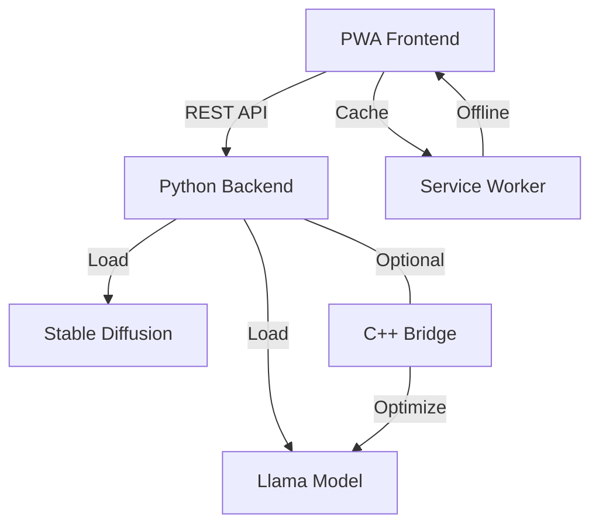

# STUDYBOARD PWA - AI Study Assistant

<div align="center">


An AI-powered Progressive Web App for 10th and 12th board exam preparation using **Llama** for conversational tutoring and **Stable Diffusion** for visual explanations.

[Features](#features) • [Architecture](#architecture) • [Installation](#installation) • [Usage](#usage) • [Deployment](#deployment)

</div>

---

## 🎓 Features

- **AI-Powered Chat**: Conversational tutor using Llama models from Hugging Face
- **Visual Learning**: Automatically generates educational diagrams using Stable Diffusion
- **Offline-First PWA**: Works offline with cached content and service workers
- **Multi-Backend Support**: Python + optional C++ optimization layer
- **Board Exam Focused**: Tailored for 10th and 12th grade curriculum
- **Fast & Local**: No API keys required - runs models locally
- **Responsive Design**: Works on desktop, tablet, and mobile devices

---

## 🏛️ Architecture

### Frontend (PWA)
- **HTML5 + Vanilla JavaScript**: Lightweight, fast-loading interface
- **Service Worker**: Offline caching and background sync
- **Progressive Enhancement**: Install as native app on any device

### Backend (Multi-Language)
- **Python (Flask)**: Primary backend for model inference
- **C++ Bridge**: Optional high-performance optimization layer
- **Communication**: RESTful API with WebSocket support

### AI Models
- **Text Generation**: Llama-2-7B / TinyLlama-1.1B (configurable)
- **Image Generation**: Stable Diffusion 2.1 Base
- **Local Execution**: All models run on-device without external APIs



---

## 🚀 Installation

### Prerequisites

- **Python 3.10+** (Anaconda recommended)
- **Git**
- **6-8GB RAM** minimum (16GB recommended for full models)
- **GPU with CUDA** (optional but recommended for faster inference)
- **~4-6GB disk space** for models

### Quick Start

#### 1. Clone Repository
```bash
git clone https://github.com/Rudra2992009/STUDYBOARD-PWA.git
cd STUDYBOARD-PWA
```

#### 2. Set Up Python Environment
```bash
# Create virtual environment
python -m venv venv

# Activate (Windows)
venv\Scripts\activate

# Activate (Linux/Mac)
source venv/bin/activate

# Install dependencies
cd backend
pip install -r requirements.txt
```

#### 3. Download Models (First Time Only)

The models will download automatically on first run, or you can pre-download:

```bash
# Option 1: Auto-download on first run (recommended)
python server.py

# Option 2: Manual download
python -c "from model_loader import ModelManager; m = ModelManager(); m.initialize()"
```

**Note**: First download may take 10-30 minutes depending on internet speed.

#### 4. Run the Application

```bash
# Start backend server
cd backend
python server.py

# In another terminal, serve frontend (optional for development)
cd public
python -m http.server 8080
```

Access at: `http://localhost:5000`

---

## 👨‍💻 Usage

### Basic Chat

1. Open the app in your browser
2. Select your class (10th or 12th)
3. Type your question (e.g., "Explain Newton's Laws of Motion")
4. Toggle "Generate Image" to include visual diagrams
5. Click Send or press Enter

### Example Queries

- **Physics**: "Explain electromagnetic induction with diagram"
- **Chemistry**: "Draw the structure of benzene molecule"
- **Math**: "Show me the graph of quadratic equation"
- **Biology**: "Diagram of human digestive system"

### PWA Installation

1. Click the install button in the address bar
2. Or go to browser menu → "Install STUDYBOARD"
3. App will be added to your home screen/desktop

---

## 👨‍🔧 Development

### Project Structure

```
STUDYBOARD-PWA/
├── backend/
│   ├── server.py              # Flask application
│   ├── model_loader.py        # AI model management
│   └── requirements.txt       # Python dependencies
├── cpp_bridge/                # C++ optimization layer
│   ├── bridge.cpp
│   ├── bridge.h
│   └── CMakeLists.txt
├── public/                    # PWA frontend
│   ├── index.html
│   ├── app.js
│   ├── styles.css
│   ├── service-worker.js
│   └── manifest.json
├── .github/workflows/         # CI/CD pipelines
│   ├── deploy.yml
│   ├── ci.yml
│   └── build-cpp.yml
├── Dockerfile                 # Container configuration
├── docker-compose.yml
└── README.md
```

### Running with Docker

```bash
# Build and run
docker-compose up --build

# Access at http://localhost:80
```

### Building C++ Bridge (Optional)

```bash
cd cpp_bridge
mkdir build && cd build
cmake ..
cmake --build . --config Release
```

---

## 🌐 Deployment

### GitHub Pages (Frontend Only)

1. Enable GitHub Pages in repository settings
2. Set source to `gh-pages` branch
3. GitHub Actions will auto-deploy on push to `main`

### Full Stack Deployment Options

#### Option 1: Docker Container
```bash
docker-compose up -d
```

#### Option 2: Cloud VM (AWS/Azure/GCP)
```bash
# Install dependencies
sudo apt update
sudo apt install python3-pip nginx

# Deploy backend
cd backend
pip3 install -r requirements.txt
gunicorn server:app --bind 0.0.0.0:5000

# Configure nginx as reverse proxy (see nginx.conf)
```

#### Option 3: Local Network
```bash
# Run server accessible on LAN
python server.py --host 0.0.0.0 --port 5000
```

---

## ⚡ Performance Optimization

### Model Selection

| Model | Size | Speed | Quality | Use Case |
|-------|------|-------|---------|----------|
| TinyLlama-1.1B | ~1.4GB | Fast | Good | CPU/Low RAM |
| Llama-2-7B | ~7GB | Medium | Excellent | GPU recommended |
| Phi-2 | ~2.7GB | Fast | Very Good | Balanced |

### GPU Acceleration

```python
# Automatic GPU detection in model_loader.py
device = "cuda" if torch.cuda.is_available() else "cpu"
```

### Memory Optimization

- Enable 8-bit quantization (add to requirements.txt):
```bash
pip install bitsandbytes
```

- Use CPU offloading for low VRAM:
```python
model.enable_model_cpu_offload()
```

---

## 🔒 Security & Ethics

### Usage Guidelines

**STRICTLY FOR EDUCATIONAL PURPOSES ONLY**

⚠️ **PROHIBITED USES**:
- Creating deepfakes or manipulated media
- Generating inappropriate content involving minors
- Any criminal or harmful applications
- Academic dishonesty (cheating on exams)

✅ **PERMITTED USES**:
- Learning and understanding concepts
- Practice problems and solutions
- Visual aids for studying
- Exam preparation

### Content Safety

- All model outputs are filtered for educational appropriateness
- Automatic rejection of non-educational queries
- No storage of personal information
- Local processing ensures data privacy

### Contact

For copyright or ethical concerns: **rudra160113.work@gmail.com**

---

## 📝 License

MIT License - See [LICENSE](LICENSE) for details

### Model Licenses
- **Llama**: Meta's License (requires acceptance)
- **Stable Diffusion**: CreativeML Open RAIL-M License

---

## 🤝 Contributing

Contributions welcome! Please:

1. Fork the repository
2. Create a feature branch (`git checkout -b feature/amazing-feature`)
3. Commit changes (`git commit -m 'Add amazing feature'`)
4. Push to branch (`git push origin feature/amazing-feature`)
5. Open a Pull Request

---

## 🐛 Known Issues & Troubleshooting

### Model Download Fails
```bash
# Clear cache and retry
rm -rf ~/.cache/huggingface
python server.py
```

### Out of Memory
```python
# Use smaller model in model_loader.py
model_name = "TinyLlama/TinyLlama-1.1B-Chat-v1.0"
```

### Slow Inference
- Enable GPU acceleration
- Use quantized models (INT8/INT4)
- Reduce `max_length` parameter

### Port Already in Use
```bash
# Change port in server.py
PORT = 5001  # or any available port
```

---

## 📊 Roadmap

- [ ] Add support for more subjects (Commerce, Arts)
- [ ] Implement voice input/output
- [ ] Multi-language support (Hindi, regional languages)
- [ ] Offline model downloads
- [ ] Quiz generation feature
- [ ] Progress tracking and analytics
- [ ] Mobile native apps (React Native)

---

## 🙏 Acknowledgments

- **Meta AI** - Llama models
- **Stability AI** - Stable Diffusion
- **Hugging Face** - Model hosting and libraries
- **Open Source Community** - Various libraries and tools

---

## 📞 Support

- **Issues**: [GitHub Issues](https://github.com/Rudra2992009/STUDYBOARD-PWA/issues)
- **Email**: rudra160113.work@gmail.com
- **Documentation**: [Wiki](https://github.com/Rudra2992009/STUDYBOARD-PWA/wiki)

---

<div align="center">

Made with ❤️ for students preparing for board exams

**[Star ⭐ this repo if you find it helpful!](https://github.com/Rudra2992009/STUDYBOARD-PWA)**

</div>